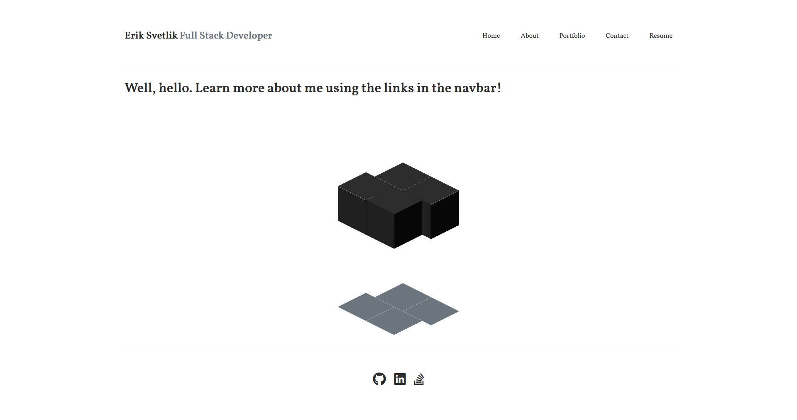

# Description

In this assignment, our task was to create a simple portfolio using our newly developed React skills. The user can use links in the navbar to view respective information about me.

This application uses the following npm packages:

- [@testing-library/jest-dom](https://www.npmjs.com/package/@testing-library/jest-dom)
- [@testing-library/react](https://www.npmjs.com/package/@testing-library/react)
- [@testing-library/user-event](https://www.npmjs.com/package/@testing-library/user-event)
- [ityped](https://www.npmjs.com/package/ityped)
- [react](https://www.npmjs.com/package/react)
- [react-awesome-loaders](https://www.npmjs.com/package/react-awesome-loaders)
- [react-dom](https://www.npmjs.com/package/react-dom)
- [react-scripts](https://www.npmjs.com/package/react-scripts)
- [web-vitals](https://www.npmjs.com/package/web-vitals)

HTML | CSS | JavaScript | Node.js | React

# Screenshot

# Link

https://eriksvetlik.github.io/reactportfolio
